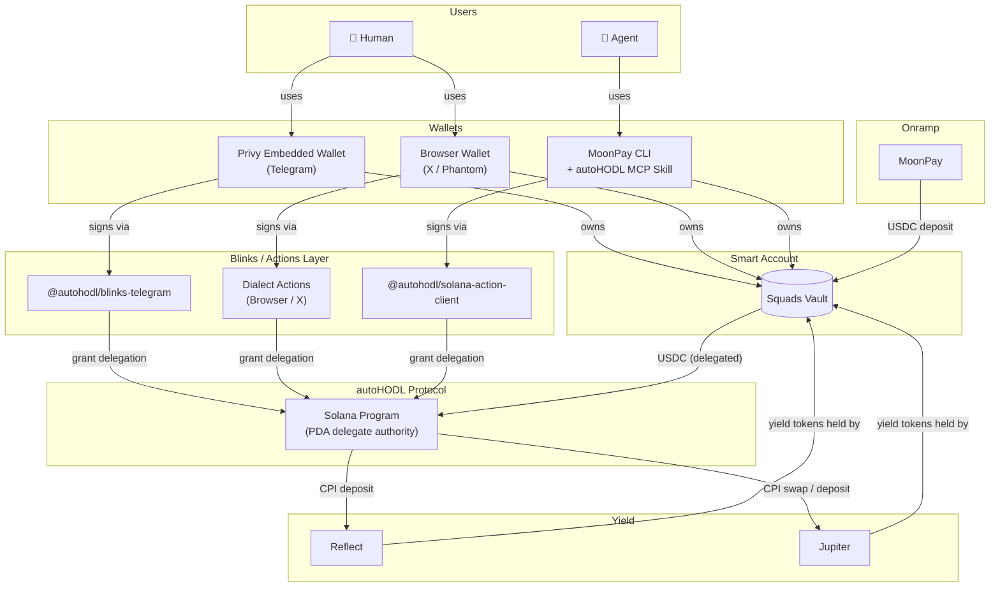

# autoHODL — System Architecture

```mermaid
flowchart TD
    subgraph Users["Users"]
        HU["👤 Human"]
        AU["🤖 Agent"]
    end

    subgraph Wallets["Wallets"]
        PW["Privy Embedded Wallet<br/>(Telegram)"]
        BW["Browser Wallet<br/>(X / Phantom)"]
        MW["MoonPay CLI<br/>+ autoHODL MCP Skill"]
    end

    subgraph BlinksLayer["Blinks / Actions Layer"]
        BT["@autohodl/blinks-telegram"]
        DA["Dialect Actions<br/>(Browser / X)"]
        SAC["@autohodl/solana-action-client"]
    end

    subgraph Onramp["Onramp"]
        MP["MoonPay"]
    end

    subgraph SmartAccount["Smart Account"]
        SV[("Squads Vault")]
    end

    subgraph Protocol["autoHODL Protocol"]
        AP["Solana Program<br/>(PDA delegate authority)"]
    end

    subgraph Yield["Yield"]
        RF["Reflect"]
        JU["Jupiter"]
    end

    HU -->|uses| PW
    HU -->|uses| BW
    AU -->|uses| MW

    PW -->|owns| SV
    BW -->|owns| SV
    MW -->|owns| SV

    PW -->|signs via| BT
    BW -->|signs via| DA
    MW -->|signs via| SAC

    BT -->|"grant delegation"| AP
    DA -->|"grant delegation"| AP
    SAC -->|"grant delegation"| AP

    MP -->|"USDC deposit"| SV

    SV -->|"USDC (delegated)"| AP

    AP -->|"CPI deposit"| RF
    AP -->|"CPI swap / deposit"| JU

    RF -->|"yield tokens held by"| SV
    JU -->|"yield tokens held by"| SV
```
